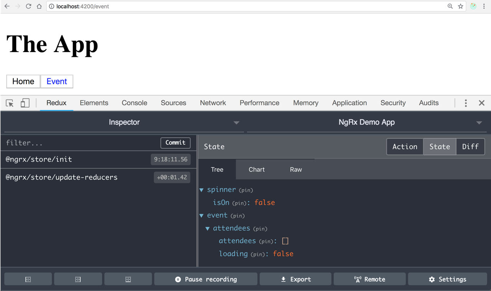

# 19. Create feature state

## 1. Add state folder and attendee actions

* Add state folder and attendee attendee actions creators.



```typescript
import { Action } from '@ngrx/store';
import { Attendee } from '../../../models';

export enum AttendeesActionTypes {
  LoadAttendees = '[Attendees Page] Load Attendees',
  LoadAttendeesSuccess = '[Attendees Page] Load Attendees Success',
  LoadAttendeesFail = '[Attendees Page] Load Attendees Fail'
}

export class LoadAttendees implements Action {
  readonly type = AttendeesActionTypes.LoadAttendees;
}

export class LoadAttendeesSuccess implements Action {
  readonly type = AttendeesActionTypes.LoadAttendeesSuccess;
  constructor(public payload: Attendee[]) {}
}

export class LoadAttendeesFail implements Action {
  readonly type = AttendeesActionTypes.LoadAttendeesFail;
  constructor(public payload: Attendee[]) {}
}

export type AttendeesActions =
  | LoadAttendees
  | LoadAttendeesSuccess
  | LoadAttendeesFail;

```



## 2. Add attendees reducer

* Make a reducer for managing attendees to an event.
* Add the state and a single switch statement as we will come back and talk about this when we do effects in the next section.



```typescript
mport { Action } from '@ngrx/store';
import { Attendee } from '../../../models';

export enum AttendeesActionTypes {
  LoadAttendees = '[Attendees Page] Load Attendees',
  LoadAttendeesSuccess = '[Attendees Page] Load Attendees Success',
  LoadAttendeesFail = '[Attendees Page] Load Attendees Fail'
}

export class LoadAttendees implements Action {
  readonly type = AttendeesActionTypes.LoadAttendees;
}

export class LoadAttendeesSuccess implements Action {
  readonly type = AttendeesActionTypes.LoadAttendeesSuccess;
  constructor(public payload: Attendee[]) {}
}

export class LoadAttendeesFail implements Action {
  readonly type = AttendeesActionTypes.LoadAttendeesFail;
  constructor(public payload: Attendee[]) {}
}

export type AttendeesActions =
  | LoadAttendees
  | LoadAttendeesSuccess
  | LoadAttendeesFail;

```



## 3. Add index.ts file to expose state logic from feature module

* Add index.ts file.



```typescript
import { ActionReducerMap } from '@ngrx/store';

import * as fromRoot from './../../state/state';
import * as fromAttendees from './attendees/attendees.reducer';

export interface EventState extends fromRoot.State {
  attendees: fromAttendees.State;
}

export const reducers: Partial<ActionReducerMap<EventState>> = {
  attendees: fromAttendees.reducer
};

```




## 4. Register feature state in the event module

* Add forFeature to a store module registration



```typescript
import { NgModule } from '@angular/core';
import { CommonModule } from '@angular/common';
import { RouterModule } from '@angular/router';
import { ReactiveFormsModule } from '@angular/forms';
import { HttpClientModule } from '@angular/common/http';
import { HttpClientInMemoryWebApiModule } from 'angular-in-memory-web-api';

import { EventComponent } from './container/event/event.component';
import { AddAttendeeComponent } from './components/add-attendee/add-attendee.component';
import { EventListComponent } from './components/event-list/event-list.component';
import { StoreModule } from '@ngrx/store';
import { reducers } from './state';
@NgModule({
  imports: [
    CommonModule,
    RouterModule.forChild([{ path: '', component: EventComponent }]),
    ReactiveFormsModule,
    HttpClientModule,
    StoreModule.forFeature('event', reducers)
  ],
  declarations: [EventComponent, AddAttendeeComponent, EventListComponent]
})
export class EventModule {}


```



## 5. Examine the state tree in the devtools

* Open browser and go to event page



## StackBlitz Link



